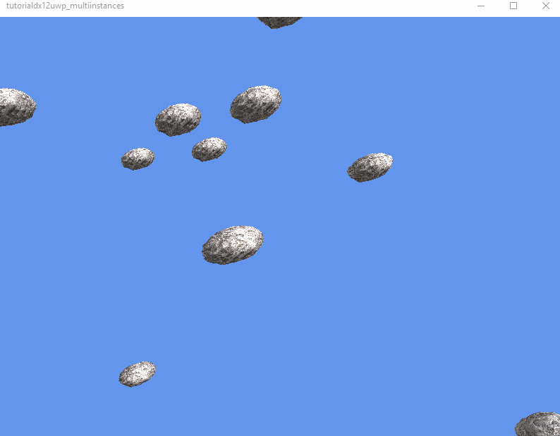

# DirectX 12: Campo de asteroides
Utilizando la API de DirectX12, simular el movimiento de meteoritos dentro de un espacio (contenedor).
## Ejecución (GIF):

### Notas:
El número de instancias y los límites del mundo (boundaries) se pueden manipular dentro de la función Initialize (Game).
